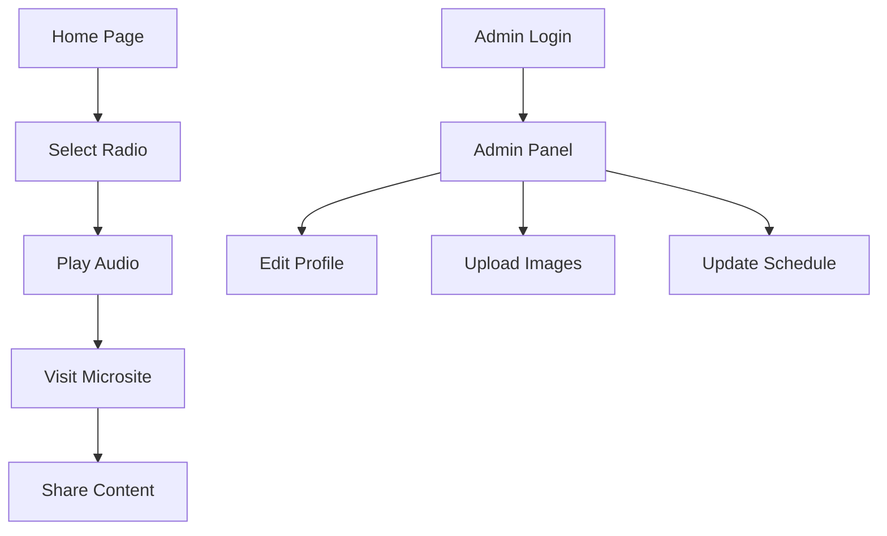

## 1. Product Overview
Aplicación web de listado de radios FM con micrositios personalizables para cada emisora. Los usuarios pueden explorar estaciones de radio, reproducir contenido en vivo y las radios pueden gestionar su presencia online con perfiles editables.

- Problema a resolver: Centralizar la información de radios FM y proporcionar una plataforma de streaming simple
- Usuarios: Oyentes de radio y administradores de emisoras
- Valor: Facilitar el descubrimiento de radios y permitir a las emisoras tener presencia digital profesional

## 2. Core Features

### 2.1 User Roles
| Role | Registration Method | Core Permissions |
|------|---------------------|------------------|
| Listener | Email registration | Browse radios, play stations, share content |
| Radio Admin | Email registration + verification | Edit radio profile, upload images, manage schedule |

### 2.2 Feature Module
Nuestra aplicación de radios FM consiste en las siguientes páginas principales:
1. **Home page**: Listado de radios, reproductor, filtros por categoría/ubicación
2. **Radio microsite**: Perfil completo de la radio con programación, descripción y botones de compartir
3. **Admin panel**: Edición de perfil, portada, descripción y horarios de programación

### 2.3 Page Details
| Page Name | Module Name | Feature description |
|-----------|-------------|---------------------|
| Home page | Radio list | Mostrar lista de radios con logo, nombre y frecuencia. Incluir búsqueda por nombre o ubicación |
| Home page | Audio player | Reproductor persistente con play/pause, volumen y visualización de radio actual |
| Home page | Categories filter | Filtrar radios por género musical, ubicación o tipo de contenido |
| Radio microsite | Profile header | Mostrar nombre, frecuencia FM, logo y portada de la radio |
| Radio microsite | Description section | Texto descriptivo editable sobre la radio y su contenido |
| Radio microsite | Schedule display | Mostrar programación semanal con horarios y nombres de programas |
| Radio microsite | Share buttons | Botones para compartir en redes sociales (Facebook, Twitter, WhatsApp) |
| Admin panel | Profile editor | Formulario para editar nombre, descripción, frecuencia y ubicación |
| Admin panel | Image upload | Subir y recortar logo y portada de la radio |
| Admin panel | Schedule manager | Crear, editar y eliminar entradas de programación con horarios |

## 3. Core Process
**Flujo del Oyente**: Usuario llega al home → Explora lista de radios → Selecciona una radio → Reproduce contenido → Visita micrositio → Comparte en redes

**Flujo del Admin de Radio**: Login → Accede a panel admin → Edita perfil → Sube imágenes → Actualiza programación → Guarda cambios

## 4. User Interface Design
### 4.1 Design Style
- Colores primarios: Azul oscuro (#1a1a2e) y blanco
- Colores secundarios: Gris claro (#f5f5f5) y acento naranja (#ff6b35)
- Botones: Estilo redondeado con sombra sutil
- Tipografía: Sans-serif moderna (Inter o similar), tamaños 14-24px
- Layout: Diseño card-based con navegación superior
- Iconos: Estilo outline minimalista

### 4.2 Page Design Overview
| Page Name | Module Name | UI Elements |
|-----------|-------------|-------------|
| Home page | Radio list | Grid responsivo de cards con logo circular, nombre en negrita, frecuencia en gris. Hover effect con sombra |
| Home page | Audio player | Barra inferior fija con controles centrados, indicador de volumen, nombre de radio actual en scroll |
| Radio microsite | Profile header | Imagen de portada full-width, logo superpuesto circular, nombre y frecuencia destacados |
| Radio microsite | Schedule display | Tabla limpia con días de semana, horarios en formato 24h, nombres de programa en cards |
| Admin panel | Image upload | Drag & drop zone con preview instantáneo, botón de recorte integrado |

### 4.3 Responsiveness
Diseño desktop-first con adaptación responsive. Breakpoints: 1200px, 768px, 480px. Optimizado para touch en dispositivos móviles con botones de tamaño mínimo 44px.