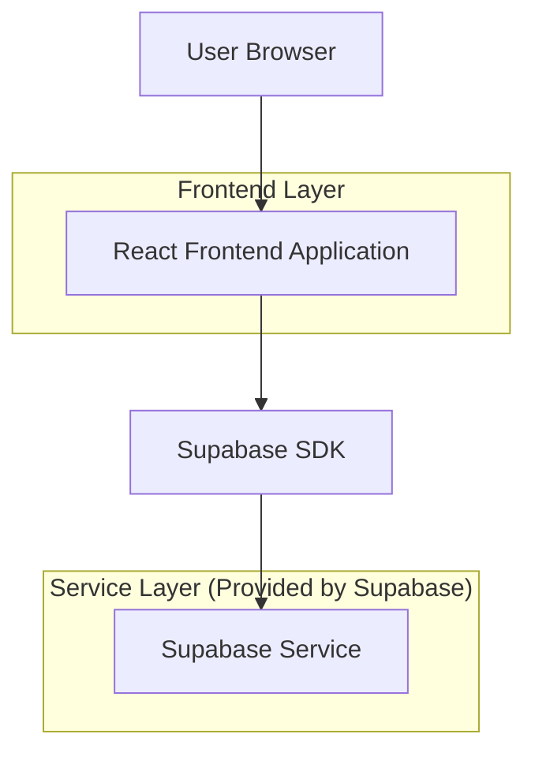
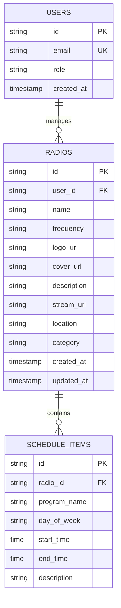

## 1. Architecture design



## 2. Technology Description

- Frontend: React@18 + tailwindcss@3 + vite
- Initialization Tool: vite-init
- Backend: Supabase (Authentication, Database, Storage)
- Audio Streaming: Integración con URLs de streaming de radios (no hosting de audio)

## 3. Route definitions

| Route | Purpose |
|-------|---------|
| / | Home page, lista de radios y reproductor |
| /radio/:id | Micrositio de radio individual |
| /admin | Panel de administración para radios |
| /admin/profile | Edición de perfil de radio |
| /admin/schedule | Gestión de programación |
| /login | Login para administradores de radio |

## 4. API definitions

### 4.1 Core API

**Obtener lista de radios**
```
GET /api/radios
```

Response:
| Param Name| Param Type  | Description |
|-----------|-------------|-------------|
| id        | string      | Radio ID |
| name      | string      | Nombre de la radio |
| frequency | string      | Frecuencia FM |
| logo_url  | string      | URL del logo |
| stream_url| string      | URL del stream de audio |
| location  | string      | Ubicación de la radio |

**Obtener detalles de radio**
```
GET /api/radios/:id
```

Response:
| Param Name| Param Type  | Description |
|-----------|-------------|-------------|
| id        | string      | Radio ID |
| name      | string      | Nombre de la radio |
| frequency | string      | Frecuencia FM |
| logo_url  | string      | URL del logo |
| cover_url | string      | URL de imagen de portada |
| description| string     | Descripción de la radio |
| stream_url| string      | URL del stream de audio |
| location  | string      | Ubicación de la radio |
| schedule  | array       | Array de objetos de programación |

## 5. Server architecture diagram

No se requiere backend dedicado. Supabase proporciona:
- Autenticación y autorización
- Base de datos PostgreSQL
- Almacenamiento de archivos
- Real-time subscriptions

## 6. Data model

### 6.1 Data model definition



### 6.2 Data Definition Language

**Tabla de usuarios (users)**
```sql
-- create table
CREATE TABLE users (
    id UUID PRIMARY KEY DEFAULT gen_random_uuid(),
    email VARCHAR(255) UNIQUE NOT NULL,
    password_hash VARCHAR(255) NOT NULL,
    role VARCHAR(20) DEFAULT 'listener' CHECK (role IN ('listener', 'radio_admin')),
    created_at TIMESTAMP WITH TIME ZONE DEFAULT NOW()
);

-- create index
CREATE INDEX idx_users_email ON users(email);
CREATE INDEX idx_users_role ON users(role);
```

**Tabla de radios (radios)**
```sql
-- create table
CREATE TABLE radios (
    id UUID PRIMARY KEY DEFAULT gen_random_uuid(),
    user_id UUID REFERENCES users(id) ON DELETE CASCADE,
    name VARCHAR(100) NOT NULL,
    frequency VARCHAR(10) NOT NULL,
    logo_url TEXT,
    cover_url TEXT,
    description TEXT,
    stream_url TEXT NOT NULL,
    location VARCHAR(100),
    category VARCHAR(50),
    created_at TIMESTAMP WITH TIME ZONE DEFAULT NOW(),
    updated_at TIMESTAMP WITH TIME ZONE DEFAULT NOW()
);

-- create index
CREATE INDEX idx_radios_user_id ON radios(user_id);
CREATE INDEX idx_radios_category ON radios(category);
CREATE INDEX idx_radios_location ON radios(location);

-- grant permissions
GRANT SELECT ON radios TO anon;
GRANT ALL PRIVILEGES ON radios TO authenticated;
```

**Tabla de programación (schedule_items)**
```sql
-- create table
CREATE TABLE schedule_items (
    id UUID PRIMARY KEY DEFAULT gen_random_uuid(),
    radio_id UUID REFERENCES radios(id) ON DELETE CASCADE,
    program_name VARCHAR(100) NOT NULL,
    day_of_week VARCHAR(10) CHECK (day_of_week IN ('Lunes', 'Martes', 'Miércoles', 'Jueves', 'Viernes', 'Sábado', 'Domingo')),
    start_time TIME NOT NULL,
    end_time TIME NOT NULL,
    description TEXT,
    created_at TIMESTAMP WITH TIME ZONE DEFAULT NOW()
);

-- create index
CREATE INDEX idx_schedule_radio_id ON schedule_items(radio_id);
CREATE INDEX idx_schedule_day ON schedule_items(day_of_week);

-- grant permissions
GRANT SELECT ON schedule_items TO anon;
GRANT ALL PRIVILEGES ON schedule_items TO authenticated;
```

**Políticas de seguridad RLS**
```sql
-- Políticas para radios
ALTER TABLE radios ENABLE ROW LEVEL SECURITY;

CREATE POLICY "Radios are viewable by everyone" ON radios
    FOR SELECT USING (true);

CREATE POLICY "Users can insert their own radios" ON radios
    FOR INSERT WITH CHECK (auth.uid() = user_id);

CREATE POLICY "Users can update their own radios" ON radios
    FOR UPDATE USING (auth.uid() = user_id);

CREATE POLICY "Users can delete their own radios" ON radios
    FOR DELETE USING (auth.uid() = user_id);
```